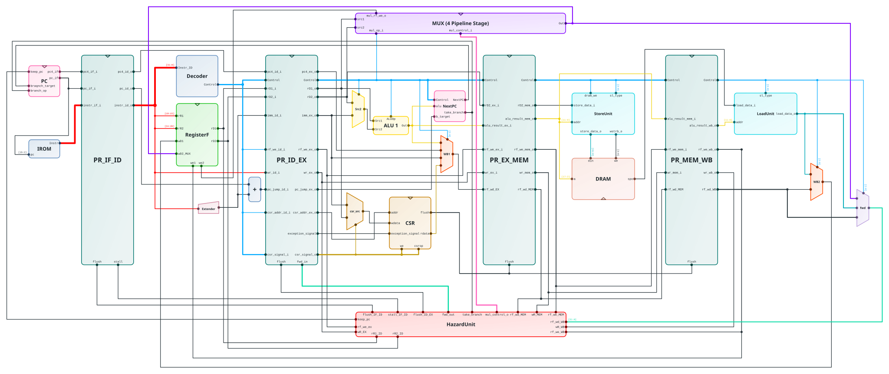

# CoreCat - 轻松绘制模块图

  

 

  
  
  
  
  

CoreCat 是一个轻量的网页端模块级电路图绘制工具，支持可视化编辑模块、端口、连线等功能。

## 主要功能
 - [x] 模块拖拽与自定义颜色
 - [x] 自由连线与交点标注
 - [x] 组合与时序逻辑模块、钟控寄存器、多路复用器
 - [x] 导入与导出（JSON/SVG/PNG）
 - [x] 常用快捷键（复制粘贴/撤销重做/垂直拖动）
 - [x] 彩蛋 

## 连线路由

- **Simple**：保留原来的 H/V 手动折线，不自动避障。
- **Smart (Auto)**：遵守端口出线方向，逐段检查模块避障。移动模块或修改端口后，优先保留仍合法的路线，失效时重新计算。搜索失败会提示原因，并保留原路线。
- **Manual**：拖动 Smart 的内部线段后进入此模式；移动模块时修复端点连接，尽量保留中部布局。内部段可以在属性面板编辑，首尾段固定在端口上。

点击 **Recompute Smart Route** 可重新交由自动路由；**Reset to Simple Route** 恢复 Simple。发生冲突的路线会有橙色提示，选中后可查看原因。Manual 允许人工绕行与穿越，不承诺自动避障。

JSON 格式升级为 v2，仍可导入旧格式；旧的多折点路线按 Manual 保留，小数坐标不再取整。共享干线、独立线路的车道分配、局部锁定和标签避让尚未实现，现有线路不会按颜色或重叠关系自动合并。

## 示例图

 - 源代码：[Escute-RV](https://github.com/Zxis233/EsCute-RV/tree/CSR)
 - JSON格式：[rscuterv.json](examples/escuterv.json)

